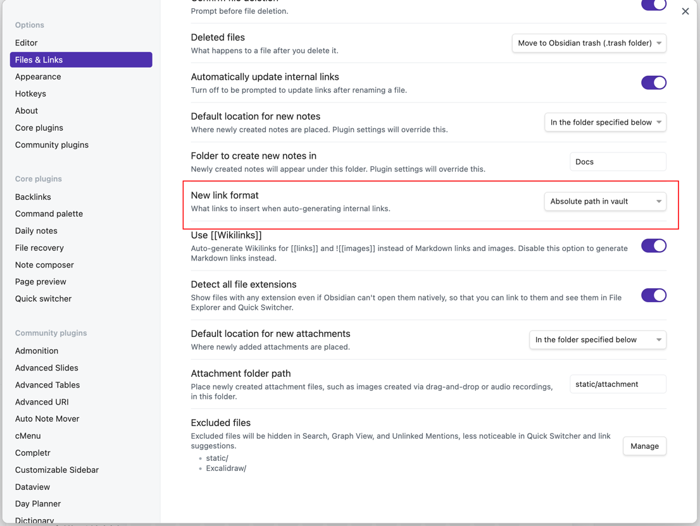

## obsidian-web-hexo

A web-based markdown viewer based on [hexo](https://hexo.io) optimized for Obsidian.


Click [Online demo](https://gwusun.github.io/03-线性回归原理分析及实现.html) to see more detail.

## Tutorial

1. Install python and install the requirement by `pip install -y pyyaml `
2. Configure the `obsidian vault home` in Makefile, e.g. /Users/sunwu/SW-KnowledgeBase.
2. Configure the `obsidian-web-hexo home` in Makefile, e.g. /Users/sunwu/Documents/hexo-websit
3. Install make and run it on localhost by `make run`
4. View on `http://localhost:4000`

## Features

- Table of contents(toc)
- Latex equations(math equations)
- images
- Wiki links
- ...

## Requirements

New link format must be set as `Absolute path in vault`:


``` 
$ hexo v
hexo: 6.3.0
hexo-cli: 4.3.0
os: darwin 22.1.0 13.0.1

node: 16.13.2
v8: 9.4.146.24-node.14
uv: 1.42.0
zlib: 1.2.11
brotli: 1.0.9
ares: 1.18.1
modules: 93
nghttp2: 1.45.1
napi: 8
llhttp: 6.0.4
openssl: 1.1.1l+quic
cldr: 39.0
icu: 69.1
tz: 2021a
unicode: 13.0
ngtcp2: 0.1.0-DEV
nghttp3: 0.1.0-DEV

```

## Tutorial

### prepare the remote(server) nginx environment

``` 
make prepare
```

### update the public site to remote server

``` 
make d
```

### run local server

``` 
make run
```
